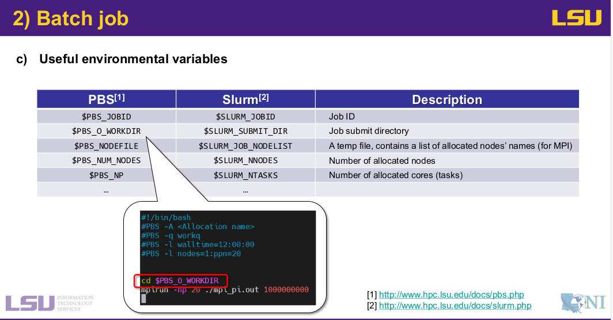
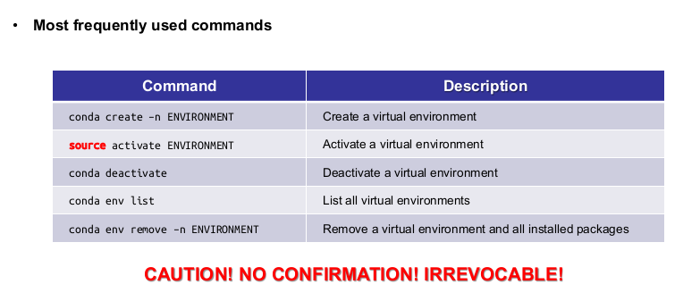
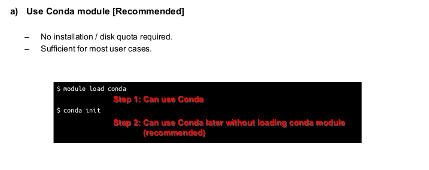
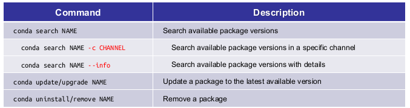
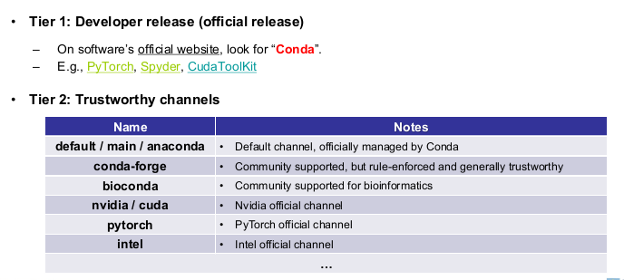
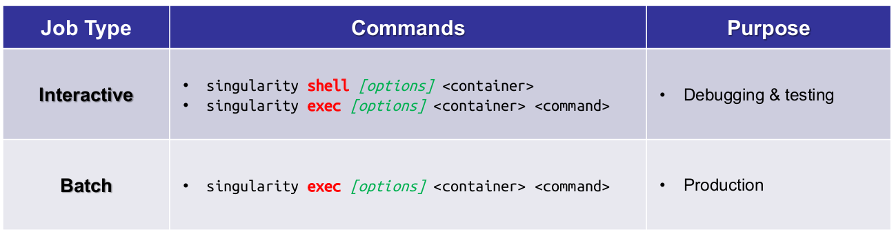
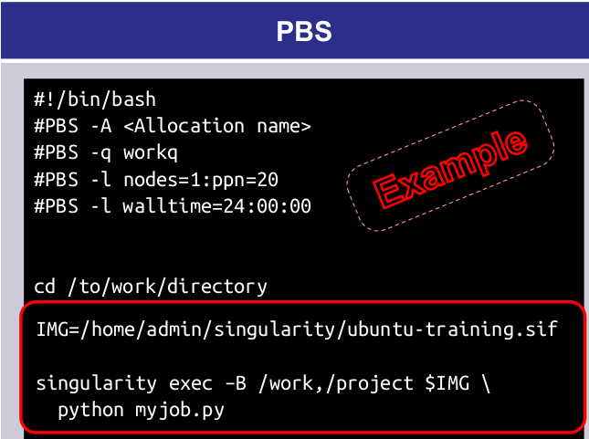
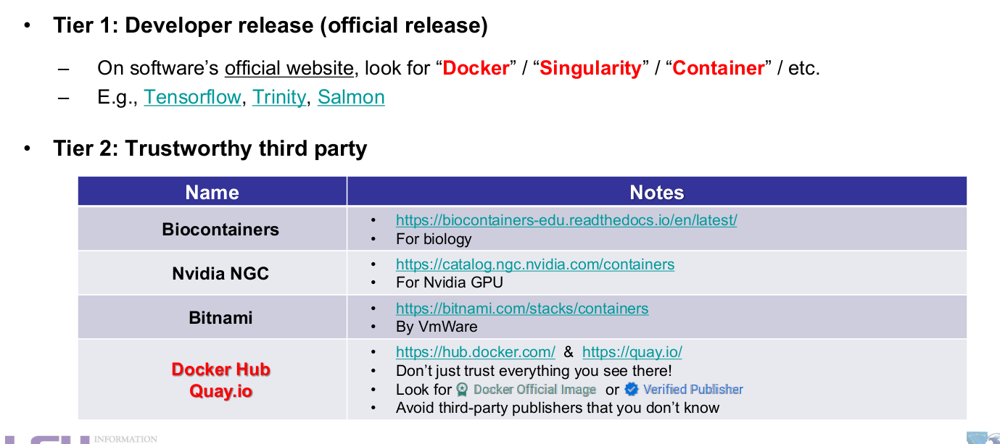
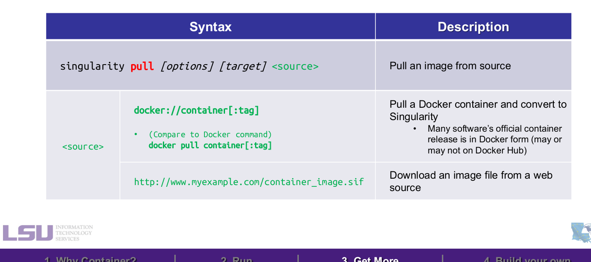
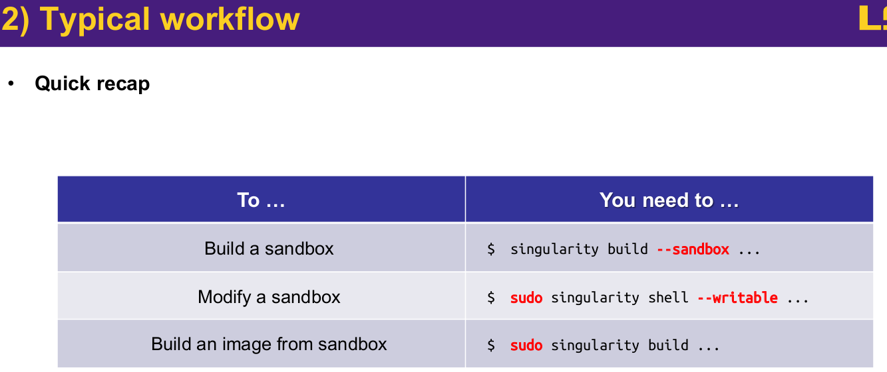

<span id="top"></span>
---
Missing concepts!
---

# Table of content 
- [Pandoc](#step-0)
- [Marp](#Marp)
- [Markdown](#markdown-review)
- [linux](#linux)
- [git](#git)
  - [creating](#creat-repository)
  - [stop tracking](#stop-tracking)
  - [fork and branching](#fork-and-branching)
  - [collaboration on Github](#collaboration-and-github)
  - [git LFS](#git-LFS)
- [make](#review-make)
- [git for hpc](git-hpc)
  - [track repository on HPC server](#hpc-track)
- [prepare and run a project on HPC](#step0-hpc)
  - [bash programing](#bash)
  - [simple step by step preparing PBS file](#basic-pbs-file)
  - [environment varibles](#env-variable)
  - [real exprements](#real)
- [conda](#conda)
  - [conda and hpc](#conda-and-hpc)
  - [python_packages_concept](#concept)
  - [LSU conda HPC](#conda-lsu)
  - [confilct with different Python versions](#pythons)
  - [tests](#tests)
- [how to write a book](#book)
- [book with slide bar](#book2)
- [singularity approach and HPC](#singularity)
  - [where to get reliable containers](#where)
  - [build your own image](#build)
- [creating my own continer](#my-container)
  - [mounting directories](#mount)
    - [very interesting Error](#jaleb)
    - [copy direcetory](#copy)
    - [Do we need a directory inside a container to mount?](#target-directory)
  - [workflow of container in hpc](#using-sif-file)
  - [Allow Container Access to Host's Display](#display)
- [Do I need to rebuild the container?](#config)
- [Do I need to compile my code again on hpc cluster?](#compile-on-cluster)
---


<!-- 

to run the md file and see the changes live

ls  selfTuroring.md | entr pandoc /_ -s -o selfTuroring.html --css pandoc.css

-->


## step 0
 
- this is a test2


## pandoc and marp
- I am using marp for presentation 
- If I need a long continous ducment i am using pandoc
- for running the pandoc I use 
```
pandoc selfTuroring.md -s  -o selfTuroring.html --css pondoc.css
```
.css file is for the theme and format the one that I am using is 

[pandoc.css](https://gist.github.com/killercup/5917178)
## live watch the edits 

To have a live preview of your Markdown document as you edit it, with changes automatically compiling and updating in an HTML file that you can view in a browser, you'll need to use a combination of tools. Here's how you can set up a live preview system using Pandoc, a file watcher like entr, and a web browser.
### Step 1: Install entr

```
on Ubuntu:

bash

sudo apt-get install entr
```
### Step 2: Set Up a File Watcher

Once you have entr installed, you can set up a file watcher that runs Pandoc to compile your Markdown file into HTML every time you save changes to the file.

Open a terminal and navigate to the directory containing your Markdown file. Run the following command:
```
bash

ls input.md | entr pandoc /_ -s -o output.html --css style.css
```
Replace input.md with the name of your Markdown file and style.css with the path to your CSS file. The /_ is a placeholder that entr uses to refer to the file that has changed.
Step 3: Open the HTML in a Browser

Open output.html in your web browser. Most modern browsers will cache the file, so you may need to manually refresh to see changes. For an even more automatic setup, you can use a browser extension or a development server that automatically refreshes the page when it detects changes to the file.

---

## marp 

we need to compile the md file like following to compile and see the results
marp myfile.md & open myfile.html

---

## markdown review 

- Commenting

```
<!--   -->
```

- heading
```
# Heading 1
## Heading 2
### Heading 3
#### Heading 4
##### Heading 5
###### Heading 6
```
- Emphasis

    Bold: Wrap text with two asterisks or underscores.

    markdown
```
**bold text**
__bold text__
```

- Italic: Wrap text with one asterisk or underscore.

```
*italic text*
_italic text_
```

- Lists: Use asterisks, plus, or minus signs.

```
- Item 1
- Item 2
- Item 3
```
- Ordered Lists: Use numbers followed by a period.

```
    1. First Item
    2. Second Item
    3. Third Item
```
- Links

To create a link, enclose the link text in brackets and then follow it immediately with the URL in parentheses.

```
[OpenAI](https://www.openai.com/)
```

- images

Similar to links, but start with an exclamation mark, followed by the alt text in brackets, and the path or URL to the image in parentheses.

```

```

- Code

    Inline Code: Wrap text with backticks.

    markdown
```
`Inline code`
```
Code Blocks: Use triple backticks or indent with four spaces for multiple lines of code.


```
```
code block
```
```


- Horizontal Rules

Use three or more asterisks, dashes, or underscores.
```
---
```
- Tables

Create tables by using vertical bars and dashes. Align text by using colons.

```

| Header 1 | Header 2 | Header 3 |
|----------|:--------:|---------:|
| Cell 1   | Cell 2   | Cell 3   |
| Cell 4   | Cell 5   | Cell 6   |
```
- Escaping Characters

Use a backslash before Markdown characters you want to escape.

```
\*Not italicized\*
```
- Task Lists

To create a task list, se dashes followed by brackets. If the task is completed, place an x inside the brackets.
```
- [x] Completed task
- [ ] Incomplete task
```


---

## linux 


**Checking the Size of Directories/Files**

   - To check the size of a specific directory or file, you can use the du (disk usage) command for directories and the ls command for files. For a directory:

    bash
```
du -sh /path/to/directory
```

- The -s option provides the total size of the directory, and -h makes the size human-readable (e.g., KB, MB, GB).

- To check the size of files within a directory (including the directory size itself), you can use:


```
du -ah /path/to/directory | less
```


The -a option lists files as well as directories.


**Checking the Time of Modification**

- To check the modification time of files and directories, use the ls command with the -l option:

 
```
ls -l /path/to/directory
```


- This command lists files and directories with details including the modification time. The modification time is displayed in the format YYYY-MM-DD HH:MM.

- For a more detailed view, including hidden files, add the -a option:


```
ls -la /path/to/directory
```


**Sorting the Output**

To sort the directories by their size, you can use the sort command in conjunction with du:

bash

```

du -h /path/to/directory | sort -h
```

---

## git

### creat repository 


###  Step 1: Create a New Repository on GitHub

1.    Log in to your GitHub account and go to your dashboard.
2.    Click on the 'New' button next to 'Repositories' on your dashboard or navigate to https://github.com/new directly.
3.    Enter a repository name. This doesn’t have to match your local directory's name, but it's recommended for simplicity.
4.    Choose if the repository will be Public or Private.
5.    Initialize the repository with a README, .gitignore, or license if needed. (Optional, and you might skip this if you are pushing an existing project that already has these files.)
6.    Click 'Create repository'.

### Step 2: Push Your Local Project to GitHub

After creating your repository on GitHub, you need to push your local project. If your local directory is not already a Git repository, you will need to initialize it first.

1. Open Terminal or Command Prompt and navigate to your project directory.

```
    bash

cd path/to/your/project
```
2. Initialize the local directory as a Git repository (if not already a Git repo).

```
bash

git init
```


3. Add the files in your local repository. This stages them for the first commit.

```
bash

git add .
```

    . adds all files. You can replace . with specific filenames to add specific files.

4. Commit the files that you've staged in your local repository.

```
bash

git commit -m "First commit"
```

5. Add the URL for the remote repository where your local repository will be pushed.

```
bash

git remote add origin https://github.com/your-username/your-repository.git
```
   
  Replace https://github.com/your-username/your-repository.git with the URL of your newly created GitHub repository.

6. Push the changes in your local repository to GitHub.

```
bash

git push -u origin main
```


 - If your main branch is named differently (like master), replace main with your branch name.


###  adding All Files in a Directory

    To add all files in the current directory:

    sh
```
git add .
```

-If you have a directory named dirName, you can add all files within it like so:

```
git add dirName/
```

- adding Specific Files

Suppose you have a directory named myDirectory, and inside it, you want to add the files named file1.txt, file2.txt, and file3.txt to staging. You can add them to Git with the following command:

sh
```
git add myDirectory/file1.txt myDirectory/file2.txt myDirectory/file3.txt
```
- Committing the Added Files

After adding the files, you can commit them with a message describing the changes:

sh
```
git commit -m "Add specific files from myDirectory"
```


- To find out which files are being tracked by Git in your repository, you can use various Git commands that provide insights into the state of your repository, including which files are tracked, untracked, staged for commit, or have been modified. Here are some commands that can help you identify tracked files:
1. git ls-files

The simplest way to list all files that are currently being tracked by Git in your repository is to use the git ls-files command:

sh
```
git ls-files
```
This command will list all the files that Git is tracking in the repository, displaying the paths relative to the repository's root directory.
2. git status

The git status command provides a broader overview of the repository's current state, including which files are tracked and have changes, which files are staged for the next commit, and which files are not being tracked by Git:

sh
```
git status
```
- Tracked files that have modifications will be listed under the "Changes not staged for commit" section.
- Untracked files will appear under the "Untracked files" section.
- Staged files ready for the next commit will be listed under the "Changes to be committed" section.


### stop tracking


### Renaming a Directory and Pushing Changes

- If you rename a directory and push the changes, Git tracks this as a deletion of the directory with the old name and the addition of a new directory with the new name. Here's how you would handle it:

- Rename the directory locally. You can do this through your file explorer or with the command line.
-  Use git add -A to stage all changes, including deletions and additions.
- Commit and push as described in the previous answer.

- Remember, Git tracks content, not files, so renaming is seen as deleting the old path and creating a new one with the same content.


#### repository and local directory

- **Local Repository**: This is your project directory on your computer where you use Git commands. When you commit changes here, they are recorded in your project's history locally.

- **Remote Repository**: This is the version of your project that is hosted on a service like GitHub. Changes made here can be pulled into your local repository, and changes made locally can be pushed to this remote repository to share them with others.


#### To Stop Tracking but Keep the File Locally
(**meaning keep the file in the track locally**)

- If you want to keep the file on your local system but remove it from the repository and stop tracking changes, use the git rm --cached command. This command removes the file from the staging area (making Git stop tracking it) but keeps it in your working directory.

   1. Open your terminal or command prompt.
   2. Navigate to your Git repository directory.
   3.  Use the following command, replacing file_name with the name of your file:

```

git rm --cached file_name
```

- If the file is inside a folder, you need to include the path:


```
git rm --cached path/to/your/file_name
```

- For multiple files or to apply the command to an entire directory, use the -r option:


```
git rm --cached -r folder_name/
```

- After running this command, you need to commit the change:


```
git commit -m "Stop tracking file_name"
```

#### To Delete the File from the Repository and Stop Tracking It

- If you intend to remove the file from both the repository and your local file system, use the git rm command without --cached:

   1.  Open your terminal or command prompt.
   2.  Navigate to your Git repository directory.
   3.  Use the following command:

```
git rm file_name
```

- Or for a directory:

```
git rm -r folder_name/
```

- Then, commit the change:

```
git commit -m "Remove file_name"
```

#### Ignoring the File in Future Commits

- If you don’t want the file to be accidentally re-added to the repository, consider adding its name to a .gitignore file at the root of your repository. This tells Git to ignore the file(s) in future operations.

    1. Open or create a .gitignore file in the root of your repository.
    2. Add the file or pattern you want to ignore. For example:

bash

- **Ignore a single file**
```
file_name
```
- **Ignore an entire directory**

```
folder_name/
```

- Save the .gitignore file and commit it:

```
git add .gitignore
git commit -m "Update .gitignore to ignore specific files"
```


#### delete from remote repository

- To make sure that the changes (like file deletion or stopping tracking a file) are reflected on GitHub or another remote repository, you need to push those changes. After committing the changes locally (with git commit), you push them using:


```
git push origin main
```

- Or, if you're using a different branch, replace main with the name of your branch:


```
git push origin your-branch-name
```


### .gitignore

Basic Syntax

   -  Blank lines are used for spacing for readability and are ignored.
   -  Comments start with a # symbol. Lines beginning with # are ignored by Git.
   -  Standard glob patterns are used for matching file names. A glob pattern is a string of literal and special characters used to match file paths.
   - Slash / at the beginning of a pattern will specify that the pattern only matches files and directories in the repository root.
   - Slash / at the end of a pattern specifies a directory.
   - Asterisk * matches zero or more characters in a file or directory name, except for a slash /.
   - Question mark ? matches any one character except for a slash /.
   - Square brackets [] match any one character inside the brackets. For example, [abc] matches a, b, or c.
   - Negation ! at the beginning of a pattern negates the pattern; it includes the pattern in what will be tracked by Git despite matching patterns defined earlier in the file.

### Best Practices

- Version control your .gitignore: It's a good practice to add .gitignore to your repository so that everyone working on the project is ignoring the same unnecessary files.

- Use global .gitignore for personal files: For files specific to your development environment (like IDE configuration files), consider using a global .gitignore file that applies to all repositories on your machine. This can be configured with git config --global core.excludesFile *~/.gitignore_global*.


### fork and branching

#### purpose

**Branches**

    1. Scope: Branches are used within a single repository. They represent parallel versions of the project contained within the same repository, allowing multiple lines of development.
    2. __Purpose__ The main purpose of branching is to isolate development work without affecting the main or master branch of the project. For example, a developer might create a branch to develop a new feature or fix a bug.
    3. Collaboration: Branches make it easy for multiple developers to work on different features or fixes simultaneously without interfering with each other's work. Once the work on a branch is complete, it can be merged back into the main branch, incorporating the changes into the project.
    4. Example Usage: Creating a branch for developing a new feature, fixing a bug, or experimenting with something new without disturbing the stable version of the project.


**Forks**

    1. Scope: Forking is a GitHub concept (though other platforms have similar concepts) that involves creating a complete separate copy of a repository at a specific point in time. This copy exists under your GitHub account, separate from the original repository.
    2.  __Purpose__: Forking is used to create a personal copy of someone else’s project. This allows you to freely experiment with changes without affecting the original project. It is often used when you want to contribute to someone else’s project. You can make changes in your fork and then submit a pull request to the original repository.
    3. Collaboration: Forks are particularly useful in open-source projects for contributing to someone else's project. By forking a project, you can make changes in your copy and then propose that the original repository incorporate your changes through a pull request.
    3.  Usage: Contributing to an open-source project, maintaining a personal version of a project, or taking a project in a new direction independently of the original version.


#### Current branch

```
git branch
```

### forking in github

#### Step-by-Step Guide to Fork a Repository on GitHub

- Log in to GitHub: Make sure you're logged into your GitHub account.
-  Find the Repository: Navigate to the original repository you wish to fork on GitHub.
-  Fork the Repository:
        Look for the "Fork" button in the top-right corner of the repository's page on GitHub.
        Click on the "Fork" button. GitHub will then create a copy of the repository in your GitHub account. This process might take a few seconds.

- After Forking

Once the repository is forked, you have your own copy on your GitHub account. You can clone this forked repository to your local machine, make changes, commit them, and push the changes back to your fork on GitHub. Here’s how:

- Clone Your Forked Repository:
1. Navigate to your forked repository on GitHub.
2. Click on the "Code" button and copy the URL provided.
3. Open your terminal or command prompt, navigate to where you want to clone the repository, and use the git clone command followed by the URL you copied.

    Example:

```
    bash

git clone https://github.com/your-username/repository-name.git
```

- Make Changes Locally: After cloning, you can make changes to the repository locally on your computer.

- Push Changes to Your Fork:

    After making changes, add and commit those changes locally using git add and git commit.
    Push your changes back to your fork on GitHub using git push.

Example:

```
bash

    git add .
    git commit -m "Description of the changes"
    git push origin main
```

- Contributing Back to the Original Repository

If you want to contribute your changes back to the original repository, you can create a pull request:

-  Navigate to Your Fork on GitHub and click the "Pull request" button.
-    Fill Out the Pull Request Form: GitHub will automatically use the differences between your fork and the original repository to fill out the form. Make sure to provide a clear description of what changes you've made and why.
-    Submit the Pull Request: Once you submit the pull request, the maintainers of the original repository will review your changes. They might merge your changes into the original repository, request changes, or discuss further implications with you.

### collaboration and github

 - When someone invites you to collaborate on a GitHub project, there's a general workflow to follow to ensure smooth collaboration. Here's a step-by-step guide to help you track and submit the changes you make to the project:
1. **Accept the Invitation**:
Go to the repository's GitHub page. If you were invited to collaborate, there should be a notification prompting you to accept the invitation.
2. **Clone the Repository**:

```
git clone https://github.com/username/repository-name.git
```

3.  **Navigate to the Repository**:
Change your directory to the cloned repository:
bash

```
cd repository-name
```

4. **Create a New Branch (optional but recommended)**:
Instead of working directly on the main branch (e.g., main or master), create a new branch for your feature or fix. This makes the collaboration process cleaner.

```
git checkout -b your-branch-name
```


5. **Make Your Changes**:
Edit, add, or delete files as necessary.
6. Track Your Changes:
After you've made some changes, check the status of your changes using:

```
git status
```

This will show you the modified files. To add these changes to be committed, use:

```
git add .
```

The . will add all changes. If you wish to add specific files, replace . with the filename.

7. **Commit Your Changes**:
Once you've added your changes, commit them with a meaningful message:

```
git commit -m "Descriptive message about the changes you made"
```

8. **Push Your Changes**:
Push your changes to GitHub:

```
git push origin your-branch-name
```

9. **Create a Pull Request**:
Once you've pushed your branch to GitHub, go to the repository's GitHub page.
Click on "Pull requests" then "New Pull Request".
Select your branch from the dropdown menu to compare it with the main branch.
Review your changes and click "Create Pull Request". Add any necessary comments or descriptions.

10. **Collaboration**:
The repository owner (or other collaborators) will review your changes. They might request some modifications.
Once everything is approved, your changes can be merged into the main branch.

11. **Sync Your Local Repository**:
After your changes are merged (or periodically, even before they are merged), you'll want to update your local repository to get any other changes from the main branch or other collaborators:

```
css
git pull origin main
```

- Remember to replace main with the name of the main branch if it's different.
Repeat:

- For every new feature or fix, you can repeat the process: creating a new branch, making changes, committing, and creating a pull request.
- Remember that Git and GitHub have a bit of a learning curve, so don't be discouraged if things seem complex at first. Over time, this workflow will become second nature. It's also worth noting that there are many other Git commands and features that can be useful, but the above steps outline a basic collaborative workflow.


### git LFS

- Using Git Large File Storage (Git LFS) is an effective way to handle large files in your Git repository without bloating the repository's size. Git LFS replaces large files in your repository with tiny pointer files. The actual files are stored on a separate server. Here's how to set up and use Git LFS to manage large files and potentially reduce your repository's size:

- Step 3: Track Large Files with Git LFS

- Specify the types of files you want Git LFS to manage. You can do this by file extension or filename. For example, to track all .zip files, you would use:

```

git lfs track "*.zip"
```


- Replace *.zip with the appropriate pattern for your large files. Each pattern you want to track must be added with a separate git lfs track command.

- After tracking the desired files, make sure to add the .gitattributes file to your repository:

```

git add .gitattributes
git commit -m "Track large files with Git LFS"
```

- Step 4: Migrate Existing Large Files to Git LFS

- If you already have large files in your repository's history, you need to migrate them to Git LFS. This step involves rewriting your repository's history, which can affect other users. Coordinate with your team before proceeding.

- you can use the git lfs migrate command to move existing large files to LFS:


```
git lfs migrate import --include="*.zip" --include-ref=everthing

```


- Replace *.zip with the pattern for your large files, and refs/heads/main with the branch you're targeting. This command rewrites the history for the specified branch, replacing the large files with LFS pointers.

- Step 5: Push Changes to Your Remote Repository

- After migrating large files to Git LFS, push your changes to the remote repository:


```
git push --force origin main
```

- Use --force with caution, as it will overwrite the remote branch with your rewritten history. This is necessary after rewriting history but can cause issues for others who have cloned the repository. Ensure all team members are aware of the change and ready to handle it.

---

## example 


2038  git lsf track "*.png" "*.h5" "*.mp4"
 2039  git-lsf track "*.png" "*.h5" "*.mp4"
 2040  git lfs track "*.png" "*.h5" "*.mp4"
 2041  git lfs migrate import --inldue="*.png" --everything
 2042  git lfs migrate import --incldue="*.png" --everything
 2043  git lfs migrate import --include="*.png" --everything
 2044  git lfs migrate import --include="*.h5" --everything
 2045  git add .gitattributes
 2046  git commit -m "track large files with Git LFS"
 2047  du -h 
---


## review-make


---

## hpc track

- When working with projects on both a local PC and an HPC (High-Performance Computing) server, and using GitHub for version control, you typically want to keep your project synchronized across these environments without necessarily tracking changes independently on the HPC server. Here's a common workflow:

   1.  Clone the Repository on HPC Server:
        To clone the project to your HPC server, use the git clone command followed by the repository URL. For example:

```
git clone https://github.com/yourusername/yourproject.git /home/user/yourproject

```

2. Working on the HPC Server:

   - When you work on the HPC server, you would typically pull the latest changes from GitHub to make sure you're working with the most up-to-date version of your project. Before you start working, you can do:

```
git pull origin main
```

- Make your changes, run your experiments, or perform computations as needed.


3. Pushing Changes Back to GitHub (if necessary):

   - If you make changes to your code on the HPC server that need to be preserved or shared with others, you would commit those changes and push them back to GitHub, just like you would from your local PC:

```
git add .
git commit -m "Description of changes made on HPC"
git push origin main
```

- This step assumes you've made changes that are relevant to be tracked, such as modifications to scripts or source code. If you're just generating data or results, those might not need to be tracked with Git and could be ignored via .gitignore.

4. Keeping HPC Work Separate (if necessary):

   - Sometimes, you might want to keep the work done on the HPC server separate from your main development branch (e.g., main or master). In this case, you can create a new branch on the HPC server before starting your work:

```    

git checkout -b hpc-work
```

- After you're done, commit your changes to this branch and push it to GitHub. This way, you can merge these changes into your main branch later, either through a pull request on GitHub or by merging the branches manually.

5. Do You Need to Track on HPC Too?

   - You do not need to maintain a separate version control system on the HPC server. The same Git repository can be used to track your project across all machines. The key is to commit and push changes made in one environment (e.g., your local PC) and pull them in the other (e.g., the HPC server) to keep them synchronized.

6. .gitignore on HPC:

   -  Ensure your .gitignore file is properly set up to ignore files that should not be tracked (e.g., large data files, binary files, temporary files). This is particularly important on HPC servers where you might generate large amounts of data.


---

## step0 hpc


1. Prepare Your Local Environment

    - Organize your project: 
    - Make sure your project directory is well-organized, with source code, data files, and any scripts you use for building or running your project neatly arranged.
    - Compile C++ code: If your project includes C++ code, compile it on your **local machine** to ensure there are no compilation errors.
    - Note any special compiler flags or libraries you use.

2. Transfer Files to the HPC System

    - Use Secure Copy (SCP) or rsync:
    -  Transfer your project directory to the HPC system using SCP or rsync.
    -  The command might look like 


```
scp -r /path/to/local/project username@hpc.domain:/path/to/remote/directory for SCP

 or rsync -av /path/to/local/project username@hpc.domain:/path/to/remote/directory for rsync.
```

#### scp for LSU

```bash 
go to the local pc

scp /path/to/local/project  davdam@smic.hpc.lsu.edu:/home

```


 
- Using Git to transfer files to an HPC (High-Performance Computing) system can streamline your workflow, especially if you frequently update your code.

3. Set Up Your Environment on the HPC

    - Load necessary modules: HPC systems often use environment modules to manage software. Use module load to load any compilers or software you need. For example, you might need to load Python, a C++ compiler, or specific libraries.
    - Install Python dependencies: If you can, use a virtual environment for Python dependencies. For example, you can create a virtual environment with python -m venv myenv and activate it with source myenv/bin/activate. Then, install your requirements using pip install -r requirements.txt.

4. **Compile C++ Code on the HPC**

    - Recompile your C++ code: Since the HPC environment might differ from your local machine, recompile your C++ code on the HPC system. Adjust your compilation commands as necessary based on the available compilers and libraries.

5. Test Your Setup

    - Run tests: Before submitting any large jobs, run tests to make sure both your Python and C++ components work as expected in the HPC environment.


6. Write Submission Scripts

    - Prepare submission scripts: HPC systems typically use job schedulers like Slurm, PBS, or SGE. Write submission scripts that load the necessary modules, activate your Python environment, and run your application.


7. Submit Jobs

    - Use the job scheduler: Submit your job to the HPC's job scheduler using a command like sbatch my_submission_script.sh for Slurm.

8. Monitor and Collect Results

    - Check job status: Use the job scheduler's commands (e.g., squeue for Slurm) to monitor your job's status.
    - Collect results: Once your job has completed, collect and review your results. Check the output and error files specified in your submission script.


### bash

**shebang or hashbang**

- #!/bin/bash is known as a shebang or hashbang. It's a character sequence at the very start of a script file that specifies which interpreter should be used to execute the script. In the case of #!/bin/bash, it tells the operating system to use the Bash shell to interpret the script.

- Here's a breakdown of the components:

    - "#" is the hash symbol that starts a comment in many scripting languages.
    - ! following the hash symbol distinguishes this comment as a special one, the shebang.
    - /bin/bash specifies the path to the Bash shell interpreter.

- This line should be the very first line in a script file. When you make the script executable and run it, the operating system reads this line to know that it should use Bash, located at /bin/bash, to execute the script's commands.

- It's important to note that /bin/bash is the common path to the Bash interpreter on many Unix-like systems, but the path could be different depending on the system configuration. Other interpreters (like Python, Ruby, etc.) can also be specified in a similar manner for their respective scripts.


---

**`dirname \ "$0\"`**

- it shows the path that the the .sh file is exacute form look at the example

- The command dirname "$0" is used in shell scripts to get the directory path of the script itself, regardless of where it's called from. Let's break down this command:

-   **dirname** is a Unix command that takes a pathname as an argument and returns the path of the directory part of the pathname. It effectively strips the last component from the supplied path, leaving just the path to the directory.

-   **$0** is a special parameter in shell scripts that represents the name of the script itself. When you execute a script, $0 contains the full path to the script if it was called with a path (e.g., ./myscript.sh or /path/to/myscript.sh). If the script was found in the PATH and executed by just its name, $0 will only contain the name of the script.

-    The quotation marks " " are used to handle any spaces or special characters in the pathname. Without them, a path containing spaces would be split into multiple arguments, likely causing errors.

-    The backticks ` (or alternatively, $( ) in modern scripts) are used for command substitution. It allows the output of the dirname "$0" command to be used as part of another command or assigned to a variable.

Putting it all together, dirname "$0" is often used in scripts to find the path to the directory where the script itself resides. This can be particularly useful for scripts that need to access files relative to their own location. For example, if you have a script and some data files in the same directory, you can use dirname "$0" to construct the path to the data files, making the script work regardless of the current working directory from which it is executed.

#### Example

```
DavDam->cd projects/beta_perigrain_v2/examples/hpcExample/3d-kalthoff-hpc/
DavDam->ls
base.conf  hpcRun.sh  run.sh  setup.py
DavDam->bash hpcRun.sh 
path= .
DavDam->cd ../..
DavDam->pwd
/home/davood/projects/beta_perigrain_v2/examples
DavDam->cd ..
DavDam->bash examples/hpcExample/3d-kalthoff-hpc/hpcRun.sh 
path= examples/hpcExample/3d-kalthoff-hpc
```

### **export**

The command **export PROJ_DIR=$HOME/peri-wheel** is used in Unix-like operating systems to set an environment variable named PROJ_DIR and make it available to subsequent processes launched from the current shell. Here's a breakdown of the command:

- export is a shell builtin command used to set environment variables so that they are inherited by any child processes or subshells. This is necessary if you want the variable to be available not just in the current shell session but also in any programs or scripts launched from this session.

- PROJ_DIR is the name of the environment variable being set. Environment variable names are typically uppercase by convention, but this is not a requirement.

-    = assigns the value on the right to the variable on the left. There should be no spaces around the = in variable assignments in the shell.

-   $HOME is a special variable in Unix-like systems that contains the current user's home directory path. It's used here as part of the value being assigned to PROJ_DIR.

-    /peri-wheel is a directory path appended to $HOME, resulting in a full path. This means that if your home directory is /home/username, PROJ_DIR will be set to /home/username/peri-wheel.


### basic pbs file 

Writing a PBS (Portable Batch System) script to submit a job to a High-Performance Computing (HPC) cluster involves creating a text file that specifies how the HPC scheduler should run your project. This file will include directives for the scheduler and the commands necessary to execute your project. Here's a step-by-step guide to creating a basic PBS file for your project, assuming it has a Bash script (run_project.sh) that runs your Python and C++ code in order:

1. Create the PBS file: Start by creating a new text file for your PBS script. This could be named **submit_project.pbs**, for example.

2. Add PBS directives: At the top of the file, add lines for PBS directives. These lines start with #PBS and are used to specify resources and settings for the job. Common directives include:
     -   -N: Name of the job.
     -   -q: The queue to submit the job to.
     -   -l: Resources requested (e.g., nodes, processors per node, walltime).
     -   -m: Mail options (e.g., send email on start, end, and abort).
     -   -M: Email address for notifications.
     -   -o: Path for the output file.
     -   -e: Path for the error file.

Here's an example of what these directives might look like

```
#PBS -N MyProject
#PBS -q batch
#PBS -l nodes=1:ppn=4
#PBS -l walltime=01:00:00
#PBS -m abe
#PBS -M your.email@example.com
#PBS -o /path/to/your/output
#PBS -e /path/to/your/error
```

3. Load modules: If your project requires specific software modules (e.g., Python, a C++ compiler), load them after the PBS directives. Use the module load command if your HPC environment uses a module system to manage software:

```
module load python/3.8
module load gcc/9.2
```

4. Navigate to your project directory: If your bash script isn’t in your home directory, add a cd command to navigate to the directory containing your project's bash script:

```
cd /path/to/your/project
```

5. Execute your script: Finally, add the command to execute your bash script. If your script is named run_project.sh, you would add:

```
bash run_project.sh
```


6. Submit your PBS script to the queue: Once your PBS script is ready, you submit it to the job queue with the qsub command:


```

qsub submit_project.pbs
```


- Here is how the **complete PBS** script might look:

```
#!/bin/bash
#PBS -N MyProject
#PBS -q batch
#PBS -l nodes=1:ppn=4
#PBS -l walltime=01:00:00
#PBS -m abe
#PBS -M your.email@example.com
#PBS -o /path/to/your/output
#PBS -e /path/to/your/error

module load python/3.8
module load gcc/9.2

cd /path/to/your/project
bash run_project.sh
```

### env variable



- **$PBS_NODEFILE**:

 In the context of a PBS job, PBS_NODEFILE is an environment variable **automatically** set by the PBS system. It points to a file that contains a list of the compute nodes allocated to the current job, with each line representing a node. If nodes are allocated more than one processor (core), the node's name will appear in the file once for each allocated processor, thus indicating the total number of processors available to the job.


## real


- pip3 install -r requirements.txt

- source .bashrc
- source .modules
- Ctrl r +type the dastor


## conda




- To use Conda to install packages listed in a requirements.txt file for your project, follow these steps. This process assumes you have Conda installed on your system. If not, you'll need to install either Anaconda or Miniconda first.

  1.  Create a new Conda environment (optional): If you don't already have a Conda environment for your project, create one using the command below. Replace myenv with the name you wish to give your environment. You can also specify a Python version (e.g., python=3.8) if your project requires a specific version.

```    

conda create --name myenv python=3.8
```

2. Activate the Conda environment: Before installing any packages, activate the environment you've just created or an existing one you intend to use.


```
conda activate myenv
```

3. Install packages using requirements.txt: Conda does not directly support installing all packages from a requirements.txt file because this file is designed for pip, Python's package installer. However, you can use pip within a Conda environment. First, ensure pip is installed in your Conda environment:


```
conda install pip
```


4. Then, use pip to install the packages from your requirements.txt file:

```

    pip install -r requirements.txt
```

- This approach leverages the best of both worlds: Conda's environment management and pip's extensive package support. Remember that while Conda can manage many packages natively, using pip as a fallback is perfectly acceptable for packages that are either not available through Conda or are more up-to-date on PyPI (the Python Package Index).


**Additional Tips**
    - List environments: conda env list or conda info --envs
    - Remove an environment: conda env remove --name myenv
    - Update Conda: conda update -n base -c defaults conda
    - Search for packages: conda search package_name
    - List installed packages: conda list


#### Understanding the relationship between Conda, Python, and how versions are managed can be a bit confusing at first. Here’s a simple way to look at it:

    - Conda is both a package manager (like pip) and an environment manager. It is used to install Python packages and can also be used to create isolated environments that contain specific versions of Python and other packages. When you install Conda (either via Miniconda or Anaconda), you don't need to install Python separately; Conda itself will install a version of Python.

    - Python Versions Within Conda: When you create a new environment using Conda, you can specify which version of Python you want to use in that environment. If you don't specify a version, Conda will use the default Python version that came with it, which might not necessarily be the latest version.

- To clarify further:

1. Installing Python on Conda

- You don’t install Python on Conda; instead, you use Conda to install Python. For example, when you create a new environment, you can specify the version of Python you want:

bash
```
conda create --name myenv python=3.8
```

- This command creates a new Conda environment named myenv and installs Python 3.8 in it.
Checking Python Version in a Conda Environment

- To know which version of Python is being used in a specific Conda environment, you can activate the environment and then check the Python version:

   2. Activate the environment:

    bash
```
conda activate myenv
```

3. Check the Python version:

bash
```
    python --version
```
This command will display the Python version installed in the currently active Conda environment.
Additional Notes

    Without specifying a Python version: If you create a Conda environment without specifying a Python version, Conda will still include Python in the environment. It will use the version that was bundled with Conda or the latest version that is compatible with other specified packages.

    Updating Python in a Conda environment: You can update the Python version in an existing environment by using the conda update command. For example, to update Python in your current environment, you could use:

    bash
```
    conda update python
```
Conda makes it straightforward to manage multiple versions of Python and ensures that different projects can have their own isolated environments with specific package versions, without interfering with each other.

----


### conda and hpc


```
conda install -c conda-forge gmsh
```


## an example of PBS file with conda 


```PBS

#!/bin/bash
#PBS -N my_job
#PBS -l nodes=1:ppn=4
#PBS -l walltime=00:30:00
#PBS -j oe
#PBS -o output.log

# Load the required module
module load python/3.8.5

# Create and activate a Conda virtual environment
conda create -n my_env python=3.8 -y
source activate my_env

# Install required packages in the virtual environment
pip install numpy scipy matplotlib

# Run your Python script
python my_script.py

# Deactivate the virtual environment
source deactivate

```


---

### **conda-forge**


Using the command conda install -c conda-forge gmsh is a straightforward way to install Gmsh using Anaconda or Miniconda, by fetching it from the conda-forge channel. This method is particularly useful for managing different software environments and can be especially convenient if you're working on a cluster where you might not have permissions to install software globally or where compiling from source might be complex due to dependency issues. Here's how to do it step-by-step:
1. Load Anaconda/Miniconda Module (If Required)

On some clusters, Anaconda or Miniconda is made available as a module. First, check if this is the case and load the module:

bash

module load anaconda

or

bash

module load miniconda

The exact command depends on your cluster's configuration. If Anaconda or Miniconda is not available as a module, it needs to be installed following the cluster's or your own user space guidelines.
2. Create a New Conda Environment (Optional)

It's often a good practice to create a new environment for each project or software toolset to avoid conflicts between dependencies. You can create a new Conda environment with:

bash

conda create --name mygmshenv python=3.9

Here, mygmshenv is the name of the new environment, and python=3.9 specifies the Python version. You can adjust the Python version according to your requirements.
3. Activate the New Environment

Before installing Gmsh, activate the environment you just created (or an existing one if you're installing there):

bash

conda activate mygmshenv

4. Install Gmsh

Now, you can install Gmsh from the conda-forge channel:

bash

conda install -c conda-forge gmsh

This command tells Conda to install the Gmsh package from the conda-forge community-maintained channel.
5. Verify Installation

After the installation completes, you can verify it by running:

bash

gmsh --version

This should print the installed version of Gmsh to the console.
Notes

    Environment Modules: If you're using a shared cluster, be aware of the software environment modules loaded (e.g., for compilers, MPI). These might affect how you use Gmsh, especially if you plan to integrate it with other software.
    Access and Permissions: Make sure you have the necessary permissions for installing software within your Conda environment and that your environment has enough space for the installation.
    Using Gmsh: With Gmsh installed, you can start using it for your mesh generation or finite element analysis projects directly within this Conda environment.

This method simplifies the installation process and manages dependencies automatically, making it a preferred approach in many cases, especially when direct internet access is available on the cluster.


## concept

---


It looks like you tried to check the version of NumPy using numpy --version, which is not the correct way to check the version of a Python package from the command line. The error message bash: numpy: command not found... occurs because numpy is not a command-line utility but a Python library.

To check the version of NumPy installed in your Conda environment (or any Python environment), you should activate your environment and then use Python to query the NumPy version. Here's how you can do it:

    First, make sure your Conda environment is activated. It looks like you're already in your environment (minConEnv), but if you need to activate it again, use:

    bash

conda activate minConEnv

Then, to check the NumPy version, run the following command:

bash
```
    python -c "import numpy; print(numpy.__version__)"
```
This command tells Python to import the NumPy library and print its version attribute, which will display the version of NumPy currently installed in your active Conda environment.

If you find that NumPy is not installed in your environment, you can easily install it using Conda with the following command:

bash

conda install numpy

This will install the latest version of NumPy available in your Conda channels. If you need a specific version, you can specify it like this:

bash

conda install numpy=1.19.2

Adjust the version number according to your requirements.


---

## conda lsu 

- install conda in lsu hpc




- virtual environment


- using **conda search**




- where to get software?





- install the packages 


----


## pythons
- python and install package on different versions 

- Given your situation, it seems you have multiple Python versions within your perienv environment, which could potentially lead to confusion about which Python interpreter is being used to run your scripts and which one has numpy installed. Here's how to address your concerns:
Identifying the Python Interpreter

1. Check the **Default Python Version**: When you activate your environment and simply run python, it uses the default Python interpreter for that environment. To check which version it is, you can run:

```
    python --version

```


2. Check the **Python Interpreter Path** : Running which python (as you did) after activating your environment shows the path to the default Python interpreter that will be used. This is the interpreter for which you should generally install packages and run scripts.

 3. **Determining Where numpy is Installed**

    -Verify numpy Installation for a Specific Interpreter: You can explicitly check if numpy is installed for a particular Python version by running:

    

```
~/.conda/envs/perienv/bin/python -m pip show numpy

```
- Replace python in the command above with python3, python3.6, etc., to check for numpy under different Python versions within your environment. If numpy is installed, this command will output details about the installation; if not, it will produce no output for that interpreter.


### Changing the Default Python Version in the Environment

- If you need to change which Python version is the default in your environment (for example, if you want python to point to Python 3.6 instead of another version):

   -  Recreating the Environment: The most straightforward way is to recreate the environment with the desired Python version, for example:

```    
conda create --name perienv_new python=3.6
```


---

## tests

- check  **numpy** version

```

 python -c "import numpy; print(numpy.__version__)"

```


- Determining **Where** numpy is Installed

    -Verify numpy Installation for a Specific Interpreter: You can explicitly check if numpy is installed for a particular Python version by running:

```
~/.conda/envs/perienv/bin/python -m pip show numpy

```


- Check the Default Python Version: 

```
    python --version
```


---

## book


Certainly! Writing a book with different chapters and a table of contents using Markdown files and converting them to HTML with Pandoc is a straightforward process. Here are the steps you can follow:

1. **Create a directory structure for your project**:
```
my-book/
├── chapters/
│   ├── chapter1.md
│   ├── chapter2.md
│   └── ...
├── metadata.yaml
└── template.html
```

2. **Write your chapters in Markdown format**:
Create a separate Markdown file for each chapter in the `chapters/` directory. For example, `chapter1.md` might contain:

```markdown
# Chapter 1: Introduction

This is the first chapter of my book...
```

3. **Create a metadata file (`metadata.yaml`)**:
This file will contain the book's metadata, such as the title, author, and the list of chapters. Here's an example:

```yaml
---
title: My Book
author: Your Name
rights: © 2023 Your Name, All Rights Reserved
chapters:
  - chapters/chapter1.md
  - chapters/chapter2.md
  - chapters/chapter3.md
...
---
```

4. **Create an HTML template (`template.html`)**:
This template will define the structure of your HTML output. Here's a basic example:

```html
<!DOCTYPE html>
<html>
<head>
  <meta charset="utf-8">
  <title>$title$</title>
  <style>
    /* Add your custom CSS styles here */
  </style>
</head>
<body>
  <header>
    <h1>$title$</h1>
    <p>By $author$</p>
  </header>
  <nav>
    <h2>Table of Contents</h2>
    $toc$
  </nav>
  <main>
    $body$
  </main>
  <footer>
    <p>$rights$</p>
  </footer>
</body>
</html>
```

5. **Convert Markdown to HTML using Pandoc**:
Open your terminal or command prompt, navigate to the `my-book/` directory, and run the following command:

```
pandoc --toc --toc-depth=2 --template=template.html --metadata-file=metadata.yaml --output=book.html chapters/*.md
```

This command will:
- `--toc`: Generate a table of contents
- `--toc-depth=2`: Set the depth of headings included in the table of contents to 2 (chapter and section headings)
- `--template=template.html`: Use the `template.html` file as the HTML template
- `--metadata-file=metadata.yaml`: Use the `metadata.yaml` file for metadata
- `--output=book.html`: Output the HTML file as `book.html`
- `chapters/*.md`: Include all Markdown files in the `chapters/` directory

After running this command, you should have a `book.html` file in your `my-book/` directory, which will contain your book's content with a table of contents and formatted according to your `template.html` file.

You can further customize the appearance of your book by modifying the `template.html` file and adding CSS styles. Additionally, you can explore other Pandoc options and features to fine-tune the output according to your needs.

---


## book2 

To have a table of contents as a sidebar on the left, and make each chapter link navigate to the respective chapter content, you'll need to use some JavaScript and CSS along with your HTML template. Here's how you can modify the provided template to achieve this:

1. **Update the HTML template (`template.html`)**:

```html
<!DOCTYPE html>
<html>
<head>
  <meta charset="utf-8">
  <title>$title$</title>
  <style>
    /* Add your custom CSS styles here */
    #sidebar {
      width: 200px;
      position: fixed;
      left: 0;
      top: 0;
      bottom: 0;
      background-color: #f1f1f1;
      overflow-y: auto;
    }

    #content {
      margin-left: 210px;
      padding: 20px;
    }
  </style>
</head>
<body>
  <div id="sidebar">
    <h2>Table of Contents</h2>
    $toc$
  </div>
  <div id="content">
    <header>
      <h1>$title$</h1>
      <p>By $author$</p>
    </header>
    <main>
      $body$
    </main>
    <footer>
      <p>$rights$</p>
    </footer>
  </div>

  <script>
    // Add click event listeners to TOC links
    document.querySelectorAll('#sidebar a').forEach(function(link) {
      link.addEventListener('click', function(e) {
        e.preventDefault();
        const target = this.getAttribute('href');
        document.querySelector(target).scrollIntoView({ behavior: 'smooth' });
      });
    });
  </script>
</body>
</html>
```

In this updated template:
- The `#sidebar` div will contain the table of contents as a fixed sidebar on the left.
- The `#content` div will contain the main content area, with a left margin to accommodate the sidebar.
- The JavaScript code at the bottom adds click event listeners to the links in the table of contents. When a link is clicked, it prevents the default link behavior and scrolls the page to the corresponding chapter content using the `scrollIntoView` method.

2. **Update the Pandoc command**:

```
pandoc --toc --toc-depth=2 --template=template.html --metadata-file=metadata.yaml --output=book.html --standalone chapters/*.md
```

The `--standalone` option is added to generate a self-contained HTML file with all the necessary code (including the JavaScript) in the output.

3. **Add chapter anchors in your Markdown files**:

In each chapter Markdown file, add an HTML anchor at the beginning of the chapter content, like this:

```markdown
# Chapter 1: Introduction <a id="chapter1"></a>

This is the first chapter of my book...
```

The `<a id="chapter1"></a>` anchor will serve as the target for the table of contents links to scroll to.

After running the updated Pandoc command, the generated `book.html` file will have a sidebar with the table of contents on the left. Clicking on a chapter link will smoothly scroll the page to the corresponding chapter content.

Note that you may need to adjust the CSS styles (e.g., sidebar width, content area margin) according to your preferences. Additionally, you can enhance the styling and functionality further by adding more CSS and JavaScript as needed.


---

## singularity

### a nice toturial
[container for hpc](https://pawseysc.github.io/hpc-container-training/index.html)


- **Note** singularity is just avaiable on the head nodes, so you need to start a interactive job


some comments

```
singularity --version
singularity --help

singulariy --help build


```
- how to get ios information 

```
cat /etc/os-release
```

- Binding a path 

```
singularity shell -B /work /home/admin/singularity/file.sif
```

- Binding multiple directory

```
singularity shell -B /work,/projecct  /home/admin/singularity/file.sif
```

###  using **--nv** for GPU

for example for **machin learing**

- for example when we are using the Tensorflow

```
import tensorflow as tf

tf.confi.list_physical_devices("GPU")

```


- exec


example

```


singularity exec /home/admin/singularity/ubuntu-training/sif python

```


or 

example  **exec -c**

```

singularity exec /home/admin/singularity/ubuntu-training/sif python -c "print('Hello world!')"

```

## singulairy shell

---

## how to run jobs in singulairty shell





### pbs and singularity





---

## how to use released images 

1. get the image 

2. **change the group** ownership

---

## where
### where to get images?

- we can convert Doker  into singularity

- on the developer website search for **Decker**, **singularity**, 


[ready Singularity](https://github.com/mkandes/naked-singularity/tree/master/definition-files)

Example

Tensorflow website and Decker


Tier 1: Developer release (official release)
–
–
- On software’s official website, look for “Docker” / “Singularity” / “Container” / etc.
E.g., Tensorflow, Trinity, Salmon





###  **E4S** a nice source for getting the ready container 

- ubuntu with spack minimum
- ubuntu GPU


[E4S](https://www.exascaleproject.org/wp-content/uploads/2022/05/E4S-2022-08-25-Shende_1.pdf)


## How to get them?





- you need to do 

``` singularity pull source
```

- but if you get the image form the Decker, or it is a Decker image you will convert it in the follwoing form


```bash
singularity pull docker://ubuntu
```


That is it!!!
 
- you can specity the storage location with **--dir**

```bash
mkdir -p siflocation

singularity pull --dir ~/path to siflocation docker://ubuntu
```


- indeed we need to convert the follwoing 

```bash

docker pull somthing ===> singularity pull docerk://something
```

- or http://

```bash

singularity pull http link

```
---

## singularity cache

- inspect

```
singularity cache list -v
```


- dry clean

```
singularity cache clean -n 
```

- really to wipethe cache 

```
singularity cache clean -f 
```

---

## singularity BUILD

1:15:00


```
singularity build mytarget.sif destination


singularity build myubuntu.sif  docker://ubuntu:20.04 
```

---

###Step 2: Change group ownership


- i need to ask hpc people to add me to the group of singularity that I can use 
singularity sell

and after getting the image I should do 

```bash
chgrp singularity <container>
```
---
## build


```bash 
sudo singularity build mytarget source
```

- making a directory of the the container to **modify the image**

```
singularity build --sandbox myTarget source
```

- **untill now you can just run the container** 
if we want to write we need 

```bash

sudo singularity shell --writable mycontainer 

for example


sudo singularity shell --writable mycontainer/

or 

 
sudo singularity shell --writable mycontainer.sif
```

 



- after modification now it is time to make or build our image from a modified image

```

sudo singularity build mynewImage.sif mylocalCOntaier 
```


## recipe


A text file containing instructions to build a container

---


## my container


###  mount

#### default mounted directory


 - When you use singularity shell to enter a container, by default, Singularity maps your home directory from the host into the container. 

- To work around this and use the container's own filesystem entirely (including its home directory), 
you can use the **--no-home** option with your singularity shell command. 
- This option prevents Singularity from mounting your host's home directory over the container's home directory. Here's how you might use it:

```bash

sudo singularity shell --writable --no-home ubuntu-min-tools
```
---

### Minmum default and /root

- Containers often have minimal setups, and depending on the base image used to create the container, a .bashrc for the root user might not exist by default.

- Creating a .bashrc File Inside the Container

1. **Identif the User's Home Directory:** First, find out what the home directory is for the user you are operating as inside the container. If you're root, this is typically **/root**. You can confirm by running **echo $HOME** inside the container.


2. Create a .bashrc File: If there's no .bashrc in the home directory, you can create one. 

```
vi /root/.bashrc
```
 
- Or, if you're a **non-root** user and know the home directory:

```bash

vi /home/username/.bashrc
```

## bind syntax


- The path ubuntu-min-tools/opt/periv2 appears to be **incorrect** because it includes what seems to be part of the command or container name (ubuntu-min-tools) rather than just the path where you want to mount the directory inside the container.


```
sudo singularity shell --writable --no-home -B /home/davood/projects/beta_perigrain_v2:/opt/periv2 ubuntu-min-tools
```


---

## jaleb

- The error you're encountering while running your script within a Singularity container indicates a problem with accessing the file system outside the container. This is a common scenario when working with containers like Singularity or Docker, especially when trying to access files or directories on the host system. Here are some steps to troubleshoot and resolve the issue:
1. **Bind Mounts**

- When you execute a Singularity container, you need to ensure that directories from the host system are accessible inside the container through bind mounts. By default, Singularity automatically binds certain directories like /home, /tmp, and /proc, but you may need to explicitly bind additional directories depending on your setup and Singularity configuration.

- To bind a directory from your host to the container, you can use the -B or --bind option with the singularity exec command. You'll want to ensure that the /work/davdam/periHpc-output/kalthoff3d/kalthof3d_hpc_h10/ directory is accessible inside the container. For example:

```sh

singularity exec --bind /work/davdam/periHpc-output:/work/davdam/periHpc-output containers/ubuntu-min-peri-require-v2.sif python3 test.py
```

This command mounts the /work/davdam/periHpc-output directory from your host to the same path inside the container, making it accessible for your script.

2. Check Container's File System Access

Verify that the container's environment has the necessary permissions to read from and write to the bound directory. Singularity containers run with the user permissions of the user who started them, so ensure that your user has the appropriate permissions for the /work/davdam/periHpc-output/kalthoff3d/kalthof3d_hpc_h10/ directory on the host.
3. Directory Existence and Permissions Inside Container

Even with correct bind mounts, you need to ensure that the directory exists and has the correct permissions inside the container. Use a shell inside the container to check the directory's existence and permissions:

```sh

singularity shell --bind /work/davdam/periHpc-output:/work/davdam/periHpc-output containers/ubuntu-min-peri-require-v2.sif
```


Once inside the container, navigate to the directory and check that it exists and your user has write permissions.
4. Container's Environment and Dependencies

Ensure that the container environment has all necessary dependencies installed, including h5py and its dependencies, configured correctly. The error could stem from a mismatch or misconfiguration within the container, even though the same script works outside of it.

If after following these steps you're still facing issues, consider revisiting the container's configuration or the way your Singularity image is built to ensure it's properly set up for your workflow, including file system access and Python environment dependencies.
User


### why the path is repeated twice here 

```
--bind /work/davdam/periHpc-output:/work/davdam/periHpc-output

```
-  In the Singularity --bind option format --bind /host/path:/container/path, the path before the colon (:) specifies the location on the host system that you want to make accessible inside the container, while the path after the colon specifies where this directory will be mounted (or seen) inside the container. The format allows you to map directories from the host to potentially different locations inside the container.

- When the path is repeated twice, as in --bind /work/davdam/periHpc-output:/work/davdam/periHpc-output, it means you are binding the /work/davdam/periHpc-output directory from the host to the same path /work/davdam/periHpc-output inside the container. Essentially, you're making the directory available inside the container at the same path as it exists on the host, maintaining a consistent path environment for applications that may rely on specific path configurations.


    Maintaining Path Consistency: You want to ensure that scripts or applications that reference specific paths can run both outside and inside the container without modifying the path references.
    Ease of Use: It simplifies the process of working with files, especially when scripts or applications are designed to work with a predefined directory structure.

### NOTE
However, you're not restricted to this approach. You can bind the host directory to a different path inside the container if needed, for example, --bind /work/davdam/periHpc-output:/data, which would make /work/davdam/periHpc-output from the host accessible as /data inside the container. This flexibility can be particularly useful for aligning with the directory structures expected by applications or when integrating with multiple containers that expect different directory layouts.

---

## copy 

### copy a directory in container

singularity copy and cp and etc didnt work I had to shell into the container and copy the directory!!


---


### target directory

When you use the `--bind` or `--volume` option with Singularity (or Docker, respectively) to mount a directory from the host system into the container, you do not need to have the target directory already existing inside the container. If the target directory does not exist, it will be created by Singularity at runtime. However, understanding the behavior when the directory does exist in the container is important:

### If the Target Directory Exists in the Container:
- **Non-Empty Directory:** If you mount a host directory to a non-empty directory inside the container, the mount will "overlay" the directory inside the container. This means that while the container is running, any files in the target directory inside the container will be "hidden" and replaced by the contents of the host directory. The original contents of the directory inside the container will not be modified or removed; they will simply be inaccessible for the duration of the mount. Once the container stops and the mount is removed, the original contents of the directory will be visible again.

- **Empty Directory:** If the directory exists and is empty, then mounting a host directory to it is straightforward. The contents of the host directory will be accessible at the mount point inside the container.

### Recommendations:
- **For Configuration Files:** If you plan to mount a `config` directory from the host to `/app/myproject/config` inside the container, it is generally a good practice to have a default `config` directory in your container with default configuration files. This approach ensures that your application can run with default settings if no external mount is provided. When you do provide an external mount, your custom or updated configuration will override these defaults without altering them permanently.

- **Maintain a Clear Structure:** To avoid confusion, especially when dealing with multiple environments or configurations, it’s helpful to maintain a clear directory structure and understand which directories will be mounted and potentially override the container's contents.

- **Documentation:** Document the behavior and expectations regarding configuration files and directories in your project's README or documentation. This can help users and collaborators understand how to customize the application’s behavior through mounts.

### Example Command:
To mount a `config` directory from your HPC home directory to `/app/myproject/config` inside the container, you would use:

```bash
singularity exec --bind /home/user/config:/app/myproject/config yourappname.sif /app/myproject/bin/simulate2d
```

In this command:
- `/home/user/config` is the path to your configuration directory on the HPC system.
- `/app/myproject/config` is the path inside the container where the application expects its configuration files.
- The application within the container, `/app/myproject/bin/simulate2d`, will read the configuration files from the mounted directory.
---

### using sif file

1. Integrating Singularity into Your Bash Script

- Modify your **run.sh** script to use Singularity for tasks that require the Python environment. 

- For Python tasks, wrap your Python command with singularity exec. For example:

```bash

singularity exec /path/to/your/container.sif python3 myfunctions.py

```


- For **MPI tasks**, if the MPI environment is outside the container and should use the HPC's native MPI, you can leave those commands as is. If the MPI environment is inside the container, use Singularity's options to run MPI applications. The exact command depends on your setup and might require additional flags for compatibility with your HPC's MPI configuration.


2. Creating a PBS Job Script

Create a PBS job script that will submit your run.sh script as a job. This job script, let's call it submit_job.pbs, might look something like this:

```bash

#!/bin/bash
#PBS -N job_name
#PBS -l walltime=01:00:00
#PBS -l select=1:ncpus=8:mem=16gb
#PBS -j oe

module load singularity   # Load Singularity if it is a module
module load mpi           # Load MPI module if your MPI tasks are outside the container

cd $PBS_O_WORKDIR # Change directory to your working directory
bash run.sh
```


--- 


## MPI and container


#### Notes on MPI and Containers


- **MPI Inside vs. Outside Containers**: Running MPI applications can be more complex when containers are involved. Ideally, the MPI version inside the container should match the version available on the HPC system to avoid compatibility issues. If your MPI application and environment are fully contained, ensure your Singularity image is set up correctly for MPI.

- **Hybrid Approaches**: In some cases, you might run non-MPI tasks within the container and MPI tasks outside, or vice versa. Tailor your script based on where the MPI environment is best utilized.

- **Testing**: Before submitting the job, test your modified run.sh script and PBS job script (submit-job.pbs) with smaller tasks to ensure everything works as expected in the HPC environmen

---


## display 

f you're inside a container and facing the "Authorization required, but no authorization protocol specified" error while trying to run a compiled C++ code that requires graphical output, the issue is likely related to X11 graphics forwarding from within the container to your host's display. Containers, by default, do not have access to the host's display server due to isolation.

Here are steps to solve this problem, focusing on Docker as it's one of the most common container platforms. The same principles apply to other container technologies, but the commands and configuration might differ.

### Allow Container Access to Host's Display

1. **Share the Display**: You need to allow the container to access the host's display. This is done by setting the `DISPLAY` environment variable inside the container to match the `DISPLAY` variable of the host system.

2. **X11 Unix Socket**: Share the X11 Unix socket directory between the host and the container by using the `-v` (volume) option in Docker.

3. **Xhost**: Temporarily allow connections to the X server on the host from any address. This is generally not recommended for public networks due to security concerns.

#### Implementation

First, on your host, run:

```bash
xhost +
```

This command temporarily allows all connections to your X server. For a more secure setup, you might specify the IP address of the container or use `xhost +local:` to only allow local connections.

Then, when running your container, add the `-e DISPLAY` and `-v /tmp/.X11-unix:/tmp/.X11-unix` options to your `docker run` command. For example:

```bash
docker run -it --rm -e DISPLAY=$DISPLAY -v /tmp/.X11-unix:/tmp/.X11-unix your_container_image
```

This command runs a container with the display environment variable set to use the host's display and shares the X11 Unix socket between the host and the container.

#### Security Note

After you've finished running your containerized application, it's a good practice to revoke the open access to your X server (if you used `xhost +` earlier) by running:

```bash
xhost -
```

This command will reset the access control to the default settings, generally denying all connections except those allowed explicitly.

### Inside a Container without Docker

If you're using a containerization technology other than Docker, or if Docker-specific solutions aren't applicable, you'll need to adjust the approach based on your container platform's way of handling networking, volumes, and environment variables. The key concepts of sharing the `DISPLAY` environment variable and the X11 Unix socket directory, however, remain the same.


---

## config

No, you generally do not need to rebuild your container every time you wish to change a parameter in your application for running on an HPC cluster. There are more efficient strategies to manage parameter changes without the overhead of rebuilding the container:

### 1. **External Configuration Files or Environment Variables**
One common approach is to use external configuration files or environment variables to pass parameters into your application. This way, you can change the parameters without altering the container.

- **Configuration Files**: You can mount a configuration file into the container at runtime that your application reads to set parameters. This file can be edited outside the container, and the changes will be reflected the next time you run the container.

    ```bash
    singularity exec --bind ./config:/app/config yourappname.sif ./bin/simulate2d
    ```

    In this example, `--bind ./config:/app/config` mounts the local `config` directory to `/app/config` inside the container, where your application can access it.

- **Environment Variables**: Alternatively, you can pass parameters as environment variables using the `-e` option with Singularity. Your application would then read these environment variables at runtime.

    ```bash
    singularity exec -e SINGULARITYENV_PARAM1=value1 yourappname.sif ./bin/simulate2d
    ```

    Ensure your application is designed to read parameters from either configuration files or environment variables as needed.

### 2. **Interactive Mode or Shell Access**
For development, testing, or debugging, you might want to run the container in interactive mode or access its shell directly. This allows you to modify files, execute commands, or run scripts inside the container without rebuilding it.

```bash
singularity shell yourappname.sif
```

Once inside, you can edit parameters in your scripts or binaries directly and run your application.

### 3. **Scripts and Command Line Arguments**
Modify your application to accept command line arguments or to read from a script that can be easily edited and passed into the container. This is particularly useful for numerical parameters, flags, or other simple configurations that might change frequently.

For example, you could modify your application to accept command line arguments for different parameters:
```bash
singularity exec yourappname.sif ./bin/simulate2d --param1 value1 --param2 value2
```

### 4. **Volume Binding for Dynamic Data**
Bind volumes (directories) from the host to the container for data or configuration files that might change between runs. This is similar to the first approach and allows your application to access different data sets or configuration files without rebuilding the container.

```bash
singularity exec --bind /path/to/data:/app/data yourappname.sif ./bin/simulate2d
```

This approach is flexible and efficient for HPC applications, as it separates the immutable aspects of your environment (which are containerized) from the mutable aspects (like data and configuration), which are managed externally.

---


## compile on cluster


No, if you compile your code inside a container on your local machine, you typically do not need to recompile it when you run the container on an HPC (High-Performance Computing) cluster. The primary advantage of using containers is to package your application along with all its dependencies into a single, portable unit that can run consistently across different computing environments.

Here's why recompilation is usually unnecessary:

### 1. **Consistent Environment:**
Containers encapsulate not just the application, but also the runtime environment, including the operating system libraries (to an extent), application binaries, and all dependencies. This consistency ensures that if your application compiles and runs inside a container on one system, it should behave the same way when the container is run on another system, such as an HPC cluster.

### 2. **Binary Compatibility:**
Since the binary executables are created in an environment that is shipped with the container, those binaries are compatible with any system where the container runtime (e.g., Docker or Singularity) is compatible. This means the binaries should execute without issues on the HPC cluster, assuming the architecture (e.g., x86_64) is the same.

### 3. **Performance Considerations:**
While the need to recompile for performance reasons (e.g., to optimize for a specific architecture) might arise, this is generally handled during the container's build process. If your application benefits significantly from being optimized for the specific hardware of the HPC cluster, you might consider building the container directly on the HPC system or incorporating architecture-specific optimizations into your container build process. However, for many applications, the difference may not justify the complexity.

### Best Practices:
- **Build Once, Run Anywhere:** Compile your code inside the container during the build process. This practice adheres to the principle of creating a container that can be run across different environments without modification.

- **Test Locally, Deploy Globally:** Test your container thoroughly in your local environment to ensure that it behaves as expected. Once confirmed, you can confidently deploy and run it on the HPC cluster.

- **Consider Using Precompiled Binaries:** For dependencies that are large or complex to compile, consider using precompiled binaries if they are available for your base container image's OS. This approach can save time both during the build process and when moving the container to different environments.

- **Optimize for Portability:** If you anticipate running your container across a wide variety of systems, aim to optimize for portability. This might mean targeting common denominators in terms of system libraries and avoiding bleeding-edge features that might not be supported everywhere.

Following these guidelines, you should be able to use your containers across different systems, including HPC clusters, without needing to recompile your code each time.


---

<div id="back-to-top" style="position: fixed; bottom: 20px; right: 20px; display: none;">
    

<a href="#top">&#x2191; Back to Top</a>


</div>

<script>
    // When the user scrolls down 20px from the top of the document, show the button
    window.onscroll = function() {scrollFunction()};
    
    function scrollFunction() {
        if (document.body.scrollTop > 20 || document.documentElement.scrollTop > 20) {
            document.getElementById("back-to-top").style.display = "block";
        } else {
            document.getElementById("back-to-top").style.display = "none";
        }
    }

    // When the user clicks on the button, scroll to the top of the document
    document.getElementById("back-to-top").onclick = function() {
        document.body.scrollTop = 0; // For Safari
        document.documentElement.scrollTop = 0; // For Chrome, Firefox, IE and Opera
    }
</script>
